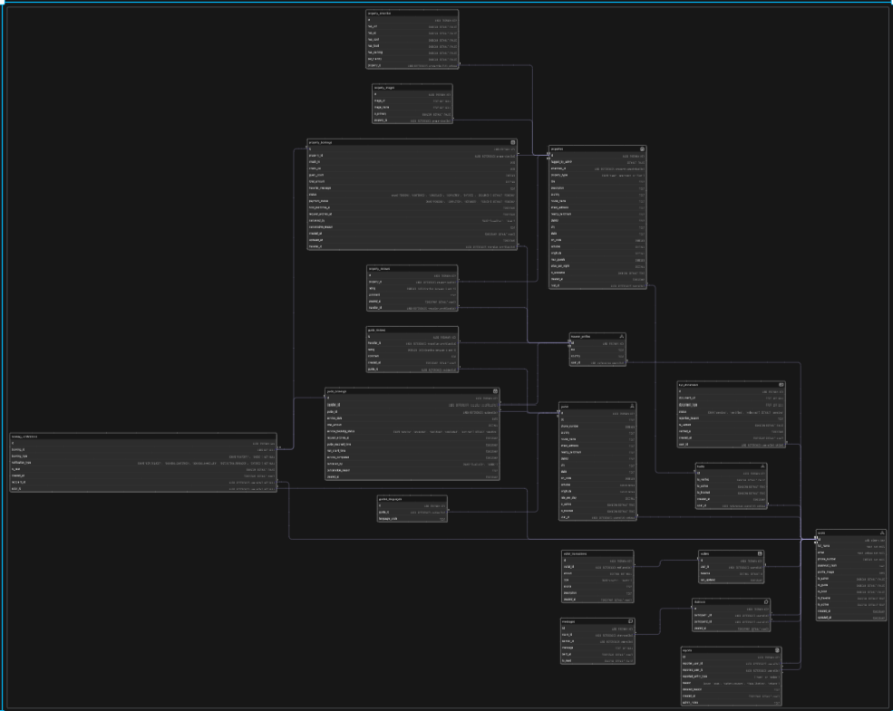

# 🗺️ HopInn – Database Design

This repository contains the relational database design for **HopInn**, a travel platform that connects travelers with local hosts and guides.

The schema is designed to support key features of the platform, including:

- User authentication and role management (traveler, host, guide)
- Booking system for stays and guide services
- Real-time chat between users
- Voice call sessions
- Trip planning and user profiles

## ⚙️ Tech Stack

- **FastAPI** (backend framework)
- **PostgreSQL** (database)
- **SQLAlchemy** (ORM)
- **Redis + Celery** (for background tasks)

---

## 🗂️ Database Schema




Here's a brief look at some of the core tables used in the database design:

### 🔹 users
```sql
users {
  id UUID PRIMARY KEY,
  full_name TEXT NOT NULL,
  email TEXT UNIQUE NOT NULL,
  phone_number INTEGER NOT NULL,
  password_hash TEXT,
  is_admin BOOLEAN DEFAULT FALSE,
  is_guide BOOLEAN DEFAULT FALSE,
  is_host BOOLEAN DEFAULT FALSE,
  is_traveller BOOLEAN DEFAULT TRUE,
  is_active BOOLEAN DEFAULT TRUE,
  created_at TIMESTAMP,
  updated_at TIMESTAMP
}

property_bookings {
  id UUID PRIMARY KEY,
  traveller_id UUID REFERENCES traveler_profiles(id),
  property_id UUID REFERENCES properties(id),
  check_in DATE,
  check_out DATE,
  total_amount DECIMAL,
  status ENUM('PENDING', 'CONFIRMED', 'CANCELLED', 'COMPLETED', 'EXPIRED', 'DECLINED') DEFAULT 'PENDING',
  payment_status ENUM('PENDING', 'COMPLETED', 'REFUNDED', 'FAILED') DEFAULT 'PENDING',
  created_at TIMESTAMP DEFAULT now()
}

chatroom {
  id UUID PRIMARY KEY,
  participant1_id UUID REFERENCES users(id),
  participant2_id UUID REFERENCES users(id),
  created_at TIMESTAMP DEFAULT now()
}

messages {
  id UUID PRIMARY KEY,
  room_id UUID REFERENCES chatroom(id),
  sender_id UUID REFERENCES users(id),
  message TEXT NOT NULL,
  sent_at TIMESTAMP DEFAULT now()
}
```
The full schema is included as an image above.
---

## 📌 Project Status

Planning is complete. Backend development begins using FastAPI.  
Follow this repo for updates on API structure, models, and core feature implementations.

---

## 📬 Contact

Feel free to connect or share feedback:  
[LinkedIn](https://www.linkedin.com/in/vivek-venmanassery) | [GitHub](https://github.com/Vivek-venmanassery-sunilkumar)
